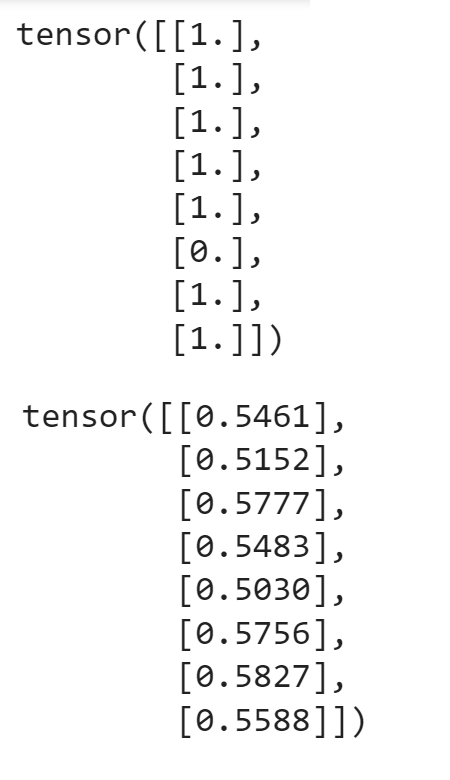

# Tralgo

Stands for **Tr**ading **algo**rithm, and is split into two main learning projects. First, the processing of human language and second, training it to produce forecasts on macroeconomic and financial timeseries.

##### Newspaper articles processing
We do some *web scraping* over available articles and process text via SciKit-learn.

##### Financial and macroeconomic inputs

Nothing is certain for now, but if this where to turn into a speculative algorithm a lot of things would need to be standardized.

### Neural Network training

Working with Gensim's Doc2Vec word embeddings, PyTorch, and some other tricks.

### Results

It is rather straightforward to get the detrended financial timeseries, but I was preoccupied with building the model so I didn't pay it much mind. I will also have to extract more text from other sources, something like FT.

Here is a snapshot of predicting power so far:
